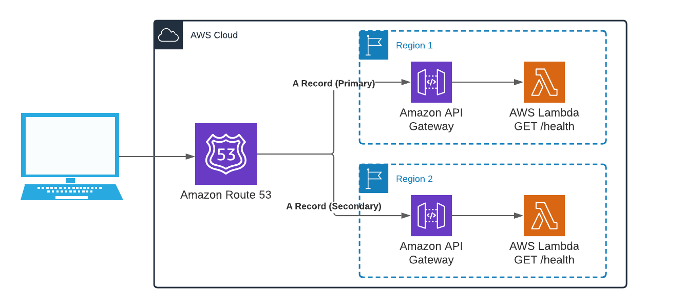

# serverless-high-availibity-multi-region Plugin

This is plugin is inspired by <https://github.com/DanteInc/serverless-multi-regional-plugin> which sets up the Cloudformation template to create
all of the necessary resources for multiregion.

Importantly, it differs from the above in that it removes the CloudFront cdn as that's not necessary for a high-availability serverless deployment. That saves both complexity and costs
when not necessary.



## Usage

In order to use this, the following properties need to be added to `serverless.yml`. This means a couple things need to be present before this can be used:

1. A hosted zone needs to be created in Route 53.
2. A certficate needs to exist in both regions in Certificate Manager that covers the domain name.
3. The lambda service should have a health check endpoint.

```{yml}
plugins:
  - serverless-high-availibity-multi-region

custom:
  dns:
    hostedZoneId: << Route53 hosted zone id where to add new A records >>
    domainName: << Domain name that should be deployed for this function, likely should include `${opt:stage, 'dev'}` variable as part of the url >>
    healthCheckResourcePath: << path to healthcheck endpoint, 'health' >>
    << region1 >>:
      acmCertificateArn: << acm certificate for defined the domain name >>
      failover: PRIMARY
    << region 2 >>:
      acmCertificateArn: << acm certificate for defined the domain name >>
      failover: SECONDARY
```

## Deployment

With the `serverless.yml` updated, we are ready to deploy onto two regions. We can run the following:

```{bash}
serverless deploy --region us-west-1 --stage development
serverless deploy --region us-east-1 --stage development
```

## Example

For a full example with a lambda function, look at the /examples directory.